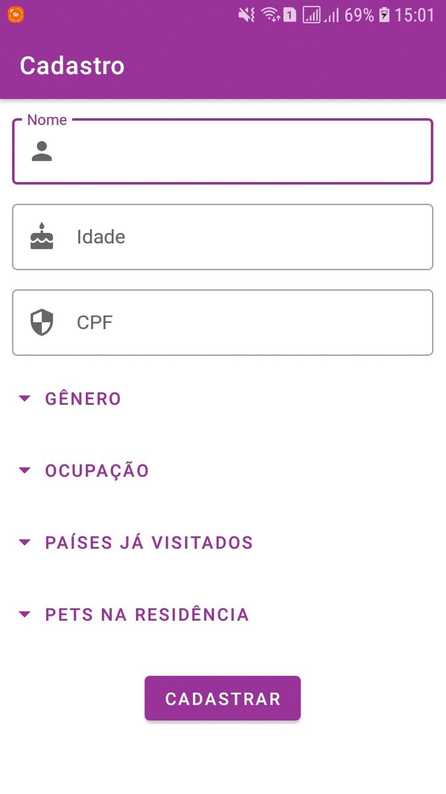

# :man: Cadastro v1.0
Essa aplicação permite que o usuário realize um cadastro de algumas informações básicas sobre ele. Essas informações são armazenadas num
banco de dados SQLite. Esse aplciativo é a uma das telas de um aplicativo de cadastro de dados de usuário.

## :computer: Tecnologias

Este projeto foi desenvolvido com as seguintes tecnologias:

-  [Java](https://www.java.com/pt-BR/)
-  [Android](https://developer.android.com/docs)
-  [Android Studio](https://developer.android.com/studio)
-  [Gerador de CPF](https://www.4devs.com.br/gerador_de_cpf)
-  [Material Design](https://material.io/components?platform=android)
-  [SQLite](https://developer.android.com/training/data-storage/sqlite?hl=pt-br)

### :arrow_forward: Em Execução:

<p align="center">
 
</p>

### :information_source: Como usar:

Para clonar e executar este aplicativo, você precisará do Git e Android Studio instalados em seu computador. Na linha de comando:

```bash
# Clonar este repositório
$ git clone https://github.com/DiegoTeixeira7/Cadastro.git

# Abra o projeto em seu Android Studio e execute

```
### :memo: Licença
Este projeto está sob a licença do MIT. Consulte a [LICENSE](https://github.com/DiegoTeixeira7/Cadastro/blob/master/LICENSE) para obter mais informações.
